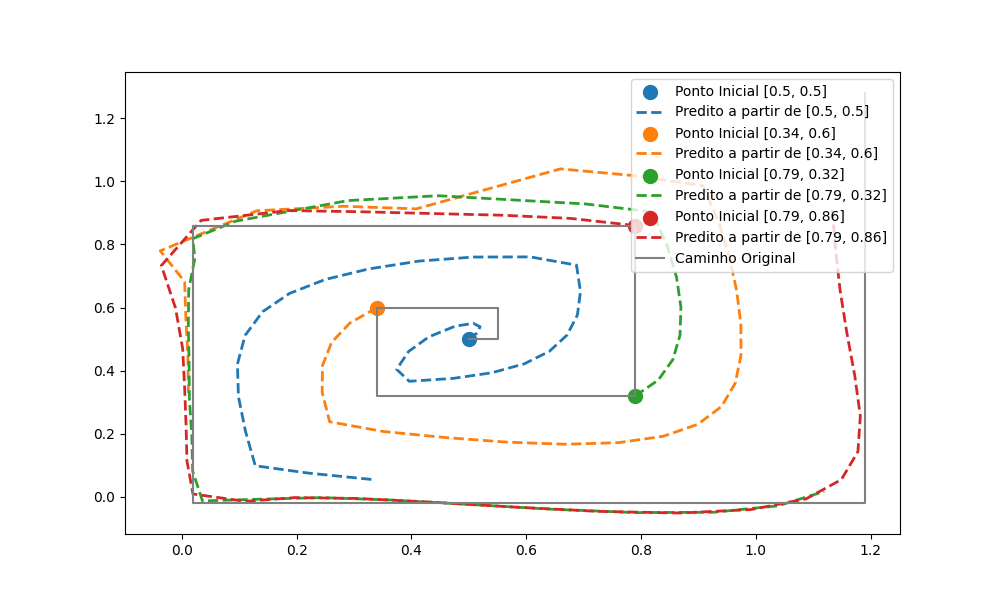

# CPS769 - Introdução à Inteligência Artificial e Aprendizagem Generativa

Este repositório contém as listas de exercícios da disciplina CPS769 - Introdução à Inteligência Artificial e Aprendizagem Generativa, do Programa de Engenharia de Sistemas e Computação (PESC) do Instituto Alberto Luiz Coimbra de Pós-Graduação e Pesquisa de Engenharia (COPPE/UFRJ).

## Questão 1

Esse exemplo simples é para auxiliar a discussão do artigo “Serial Order A Parallel Distributed Processing Approach” que todos já devem ter lido. O objetivo é prever um padrão de figura, por exemplo um quadrado, usando uma Rede Neural Recorrente (RNN). Fornecemos o código em Python de um exemplo de geração do padrão 2-D de quadrados e treinamento de uma RNN para prever a sequência cíclica [0, 25, 0, 25], [0, 75, 0, 25], [0, 75, 0, 75], [0, 25, 0, 75], [0, 25, 0, 25].

1. **Entenda o código e explique qual a RNN que ele modela (faça o desenho). Explique a parte do código que define a RNN.**

    **Resposta:**

    O código pode ser explicado dividindo-o em 6 partes:
    - **Definição do caminho quadrado:** O código define um conjunto de coordenadas que formam um caminho quadrado na variável `square_path`.
      ```python
      square_path = np.array([
          [0.25, 0.25],
          [0.75, 0.25],
          [0.75, 0.75],
          [0.25, 0.75],
          [0.25, 0.25]
      ])
      ```
    - **Geração dos dados de treinamento:** O caminho quadrado é repetido várias vezes para formar os dados de treinamento.
      ```python
      num_repeats = 4
      data = np.tile(square_path, (num_repeats, 1))
      x_train = data[:-1].reshape(-1, 1, 2)
      y_train = data[1:].reshape(-1, 2)
      ```
    - **Definição e compilação do modelo RNN:** O modelo RNN é definido usando uma camada LSTM (_long short-term memory_) seguida de uma camada densa e depois é compilado configurando o algoritmo ADAM como otimizador e o Erro Médio Quadrático como função de perda.
      ```python
      model = models.Sequential([
          layers.LSTM(50, activation='relu', input_shape=(num_repeats, 2)),
          layers.Dense(2)
      ])
      model.compile(optimizer='adam', loss='mse')            
      ```

    
    _Diagrama de uma Rede Neural Recorrente (RNN) com dois neurônios de entrada e dois neurônios de saída (camada densa) e uma camada LSTM modelada no código fornecido._

    - **Treinamento do modelo:** O modelo é treinado com os dados gerados, utilizando inicialmente 300 épocas.
      ```python
      model.fit(x_train, y_train, epochs=300, verbose=0)
      ```
    - **Geração das previsões:** As previsões são geradas.
      ```python
      predictions = model.predict(x_train[:5])
      ```
    - **Plotagem dos resultados:** As previsões são plotadas e comparadas com o caminho original.
      ```python
      plt.plot(data[:, 0], data[:, 1], label='Original Path', linestyle='dashed', color='gray')
      plt.plot(predictions[:, 0], predictions[:, 1], label='Predicted Path', color='blue')
      plt.scatter(square_path[:, 0], square_path[:, 1], color='red')
      plt.legend()
      plt.show()
      ```

    Este código foi levemente alterado por mim, criando-se a classe `PathPredictor` e fazendo as alterações necessárias para responder os próximos itens.

2. **Treine a rede. Aprenda como fazer, e explique.**

    **Resposta:**

    Como dito no passo (d) do item anterior, o treinamento é realizado utilizando a função `fit` do modelo. Utilizando a configuração inicial, com 300 épocas, o treinamento demorou cerca de 11 segundos.

3. **Faça a previsão de algumas trajetórias, quando o ponto inicial varia. O que você conclui?**

    **Resposta:**

    Foi feita a previsão para o ponto inicial original do código dado, $(x_1=0.25$ e $x_2=0.25)$ e depois foram testados os outros vértices do quadrado. Os pontos são previstos em sequência, sendo a previsão anterior a entrada da próxima previsão, somando um total de 4 previsões para cada ponto inicial. O resultado pode ser observado na figura abaixo.

    
    _Previsão para diferentes pontos iniciais_

    Todas as previsões divergem do caminho original no ponto $(x_1=0.50$ e $x_2=0.25)$, o que indica uma provável incompatibilidade do modelo para prever esse caminho, uma vez que foram testadas diversas variações de número de épocas e de repetições do caminho original no treinamento.

4. **Modifique a RNN usada e observe o que acontece.**

    **Resposta:**

    Para este teste, o ponto inicial foi retornado para a configuração original $(x_1=0.25$ e $x_2=0.25)$ e foram testadas diferentes combinações de épocas e número de repetições.

    | Nº Repetições | Épocas | Tempo Treinamento (s) | Tempo Total (s) |
    |---------------|--------|-----------------------|-----------------|
    | 4             | 300    | 12                    | 12.2            |
    | 40            | 300    | 13.5                  | 13.7            |
    | 400           | 300    | 26.4                  | 26.6            |
    | 40            | 600    | 19.6                  | 19.8            |
    | 40            | 900    | 29.2                  | 29.1            |

    Pela tabela acima, é possível observar o aumento do tempo de execução, mais especificamente do tempo de treinamento, tanto com o aumento do número de repetições quanto com o aumento do número de épocas. Os resultados das previsões podem ser visualizados nas figuras abaixo.

    
    _Previsão para 4 repetições e 300 épocas_

    
    _Previsão para 40 repetições e 300 épocas_

    
    _Previsão para 400 repetições e 300 épocas_

    
    _Previsão para 40 repetições e 600 épocas_

    
    _Previsão para 40 repetições e 900 épocas_

5. **Quais os pontos principais que você concluiu do artigo “Serial Order A Parallel Distributed Processing Approach”?**

    **Resposta:**

    A teoria de Michael I. Jordan sobre ordem serial em sequências de ações usa redes neurais para entender e reproduzir a ordem das ações ao longo do tempo. Essas redes mantêm uma "memória" do que já aconteceu, usando conexões que alimentam as saídas de volta para as entradas, ajudando a lembrar das ações passadas. A rede aprende ajustando seus parâmetros para reduzir erros entre o que foi previsto e o que realmente aconteceu.

    Isso faz com que a rede consiga generalizar a partir de sequências aprendidas e continuar funcionando bem, mesmo com pequenas perturbações. Essencialmente, a rede se torna uma memória dinâmica que pode voltar às suas trajetórias aprendidas, garantindo que as sequências de ações sejam produzidas corretamente, mesmo começando de pontos diferentes.

6. **Qual a diferença da RNN usada no código em relação ao artigo “Serial Order A Parallel Distributed Processing Approach”?**

    **Resposta:**

    No artigo, a rede é composta por unidades de plano, estado e saída, com conexões recorrentes que definem a função de próximo estado, e enfatiza a capacidade de aprender e generalizar trajetórias no espaço de estado. Em contraste, a RNN do código usa uma arquitetura LSTM simples, que captura dependências temporais através de sua memória interna, sem distinções explícitas entre plano e estado. A abordagem de Jordan foca em representações distribuídas e paralelismo, enquanto a RNN do código adota técnicas convencionais de redes neurais recorrentes.

7. **Inclua, nos dados de treino uma figura de uma espiral quadrada, e experimente o que a rede aprendeu.**

    **Resposta:**

    Para gerar o caminho em espiral foi implementado o método `generate_spiral_square` (código no final do relatório), o qual gera uma lista no mesmo formato da `square_path` fornecida, porém com os pontos formando uma espiral quadrada. O resultado da previsão pode ser observado na figura abaixo.

    
    _Previsão do caminho espiral_

