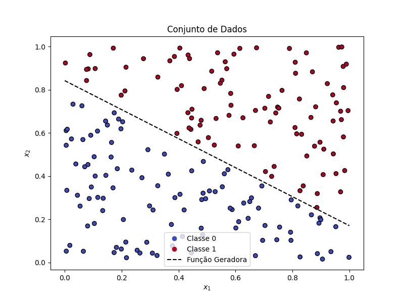
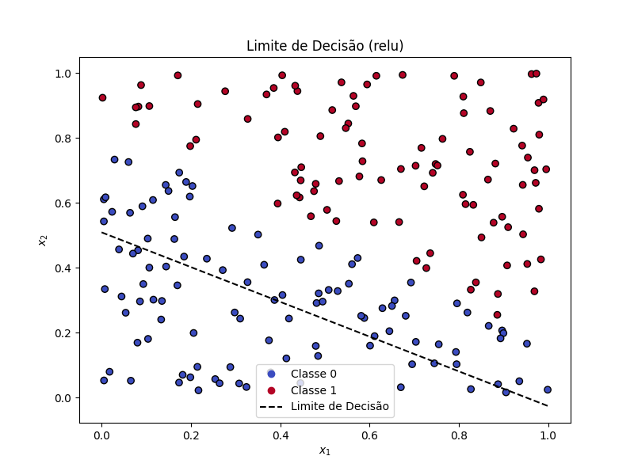
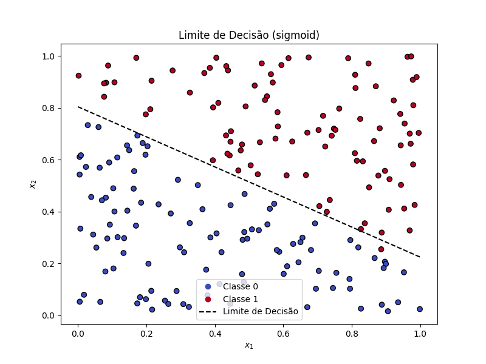

# CPS769 - Introdução à Inteligência Artificial e Aprendizagem Generativa

Este repositório contém as listas de exercícios da disciplina CPS769 - Introdução à Inteligência Artificial e Aprendizagem Generativa, do Programa de Engenharia de Sistemas e Computação (PESC) do Instituto Alberto Luiz Coimbra de Pós-Graduação e Pesquisa de Engenharia (COPPE/UFRJ).

### Questão 1

O objetivo deste trabalho é entender como um perceptron com duas entradas e uma entrada de bias classifica pontos em um espaço 2-D. Você usará duas funções de ativação diferentes: ReLU e Sigmoid.

1. Implemente um perceptron com duas entradas e uma entrada de bias.
2. Gere um conjunto de dados de pontos em um espaço 2D. Os pontos devem ser classificados em duas classes com base em suas coordenadas.
3. Treine o perceptron em um conjunto de dados de pontos em um espaço 2-D (escolha).
4. Use duas funções de ativação diferentes (Rectified Linear Unit (ReLU) e Sigmoid) para classificar os pontos.
5. Visualize os limites de decisão para ambas as funções de ativação.

Responda às seguintes perguntas com base no programa Python que você deverá fazer, e em suas observações:

1. Explique o processo de geração de dados no programa. Como os pontos são classificados em duas classes?

   **Resposta:**

   No programa, os dados de treinamento são gerados usando a classe DataGenerator (código no final deste relatório). Essa classe gera um conjunto de pontos aleatórios em um espaço 2D com coordenadas entre 0 e 1. Uma linha aleatória é gerada com uma inclinação (slope) e uma interceptação (intercept) aleatórias.

   Cada ponto é então classificado com base na posição relativa à linha. Especificamente, os pontos que estão acima da linha (onde a coordenada y é maior que a soma da inclinação vezes a coordenada x mais a interceptação) são classificados como pertencentes à classe 1, enquanto os pontos abaixo da linha são classificados como pertencentes à classe 0. Isso resulta em um conjunto de dados com pontos claramente divididos em duas classes.

   O *random seed* foi travado em 43 para garantir a repetibilidade do experimento (mesmo conjunto de dados a cada execução). O conjunto de dados utilizado pode ser visualizado na figura abaixo.

   
   
2. Qual é o papel da função de ativação no perceptron? Compare as funções de ativação ReLU e Sigmoid.

   **Resposta:**

   A função de ativação no perceptron determina a saída do neurônio com base na soma ponderada de suas entradas. Ela introduz não-linearidade no modelo, permitindo que ele resolva problemas mais complexos.

   Comparação entre ReLU e Sigmoid:
   - **Sigmoid**: Retorna um valor entre 0 e 1, mapeando a soma ponderada de entradas para uma curva em forma de "S". É útil para problemas onde a saída precisa ser interpretada como uma probabilidade, mas pode sofrer com o desvanecimento do gradiente em redes profundas.
   - **ReLU (Rectified Linear Unit)**: Retorna a entrada diretamente se for positiva; caso contrário, retorna zero. É computacionalmente eficiente e ajuda a resolver o problema do desvanecimento do gradiente, comum em redes profundas.
   
3. Treine o perceptron com funções de ativação ReLU e Sigmoid. Mostre os pesos finais para ambos os casos.

   **Resposta:**
    
   O treinamento do perceptron é feito utilizando o método train da classe Perceptron (código no final deste relatório). Durante o treinamento, para cada época, o algoritmo percorre todos os pontos de dados de treinamento, calcula a soma ponderada das entradas (incluindo um termo de bias), aplica a função de ativação (ReLU ou Sigmoid) para obter a previsão, e então calcula o erro como a diferença entre o rótulo real e a previsão. Utilizando a derivada da função de ativação, os pesos são ajustados de acordo com a taxa de aprendizado para minimizar o erro. Este processo é repetido por um número especificado de épocas até que os pesos sejam suficientemente ajustados para classificar os pontos de dados corretamente.

   A tabela abaixo apresenta os resultados para o treinamento do perceptron utilizando 1000 épocas para as duas funções de ativação.

    | Função de Ativação | Peso $w_0$ | Peso $w_1$ | Peso $w_2$ |
    |--------------------|------------|------------|------------|
    | ReLU               | 0.79833    | 1.49001    | -0.75895   |
    | Sigmoid            | 4.52860    | 7.80608    | -6.28154   |

    *Observação: Tempo de treinamento (ReLU): 2.60896 segundos. Tempo de treinamento (Sigmoid): 1.80149 segundos.*

   
4. Trace os limites de decisão para ambas as funções de ativação. Descreva quaisquer diferenças que você observar.

   **Resposta:**

   Para traçar os limites de decisão, plotamos a reta formada pelos pesos do perceptron. O resultado é exibido nas duas figuras abaixo.

  
  

   Para os 200 pontos do conjunto de dados utilizado nesse experimento, a função de ativação ReLU apresentou um erro considerável (muitos pontos azuis acima do limite de decisão). Já a função de ativação Sigmoid pararece errar apenas um ponto (ponto vermelho abaixo do limite de decisão).

5. Como as funções de ativação ReLU e Sigmoid afetam a capacidade do perceptron de classificar os pontos?

   **Resposta:**

   A função de ativação ReLU permite que o perceptron aprenda de forma mais rápida e eficaz, especialmente em problemas com muitas entradas. No entanto, pode introduzir uma linearidade que nem sempre é ideal para todos os problemas. A Sigmoid, por outro lado, suaviza a saída, tornando-a mais adequada para problemas onde as classes se sobrepõem, mas pode sofrer com o desvanecimento do gradiente em redes profundas.

   Além disso, como observado no item anterior, a função de ativação ReLU leva o perceptron a um erro de treinamento muito maior que o da função de ativação Sigmoid.

6. Como o número de iterações para a aprendizagem afeta o desempenho do perceptron e o limite de decisão?

   **Resposta:**

   Aumentar o número de iterações geralmente melhora o desempenho do perceptron, permitindo que ele ajuste os pesos mais precisamente e aprenda melhor os padrões nos dados de treinamento. No entanto, após um certo ponto, pode haver retornos decrescentes, e o perceptron pode começar a superajustar aos dados de treinamento, prejudicando a generalização.

7. Quais são algumas limitações potenciais do uso de um perceptron de camada única para tarefas de classificação? Sugira possíveis melhorias.

   **Resposta:**

   Um perceptron de camada única só pode resolver problemas linearmente separáveis. Não pode lidar com problemas não linearmente separáveis, como o XOR. Possíveis melhorias incluem o uso de múltiplas camadas (redes neurais profundas), diferentes funções de ativação, regularização, e técnicas avançadas de otimização, como gradient descent com momentum ou Adam.

8. Seria possível fazer o treinamento da lista anterior apenas aumentando o número de neurônios de 1 para N? Explique de acordo com os artigos que você leu.

   **Resposta:**

   Aumentar o número de neurônios em uma rede neural simples pode melhorar a capacidade de representar os dados, mas não resolve os problemas fundamentais de aprendizado de padrões temporais e complexos. De acordo com os trabalhos de Jordan (1986) e Elman (1990), é necessário considerar a estrutura da rede, a inclusão de unidades de contexto ou estado, e técnicas avançadas de treinamento para lidar eficazmente com dados sequenciais e complexos. Portanto, para o treinamento da lista anterior, simplesmente aumentar o número de neurônios não seria suficiente; é preciso também adaptar a arquitetura da rede para capturar a dinâmica temporal e a estrutura dos dados.
