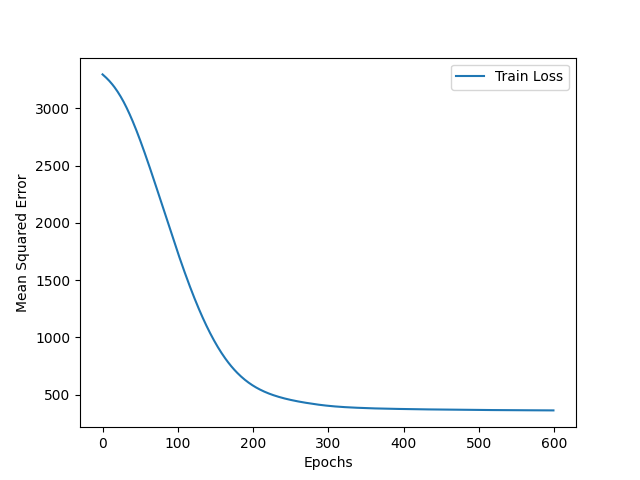

# CPS769 - Introdução à Inteligência Artificial e Aprendizagem Generativa

Este repositório contém as listas de exercícios da disciplina CPS769 - Introdução à Inteligência Artificial e Aprendizagem Generativa, do Programa de Engenharia de Sistemas e Computação (PESC) do Instituto Alberto Luiz Coimbra de Pós-Graduação e Pesquisa de Engenharia (COPPE/UFRJ).

## Questão 1

O objetivo deste trabalho é entender como construir um modelo preditivo simples (de Redes Neurais) usando uma ou mais camadas ocultas, e se familiarizar com os códigos em Python. Nesta tarefa, você deverá construir um modelo de rede neural simples para prever a nota de cada aluno em uma turma com base em duas features:

- Fração de palestras assistidas
- Número de horas estudadas por semana (até o máximo de 8 horas em uma semana).

### Sobre a Rede Neural e programa:

- A sua rede neural deverá ter uma camada oculta com 3 neurônios. Portanto teremos 2 entradas (as 2 features), uma camada oculta e, na camada de saída, um neurônio.
- Os dados de entrada são fornecidos em uma planilha .ods (libreoffice), com os dados de 500 estudantes.
- Uma vez lido, o seu dataset deve ser aleatoriamente dividido de forma a que 80% seja para treino do modelo e os restantes 20% para teste.
- No seu programa:
  - Use um Scaler padrão do sklearn para dimensionar os dados de treinamento. Explique o motivo de escalonar os dados de entrada.

    **Explicação:**

    Escalonar os dados de entrada normaliza suas distribuições, levando a média para zero e o desvio padrão para o valor unitário, permitindo uma convergência mais rápida e estável do modelo de machine learning, pois o modelo não precisa lidar com features de ordem de grandeza diferentes.

  - Para a camada oculta, use a função de ativação ReLU (Rectified Linear Unit).
  - A camada de saída usa a ativação linear padrão (explique o que é).

    **Explicação:**

    A ativação linear padrão retorna a entrada sem modificações ($f(x)=x$), usada em problemas de regressão para prever valores contínuos.

  - Use o algoritmo de otimização Adam (Adaptive Moment Estimation). Explique bem resumidamente as vantagens em relação ao Stochastic Gradient Descent padrão.

    **Explicação:**

    Adam ajusta a taxa de aprendizagem para cada parâmetro individualmente e utiliza momentos dos gradientes, permitindo convergência mais rápida e estável.

  - Use mean square error para a função de perda. Explique bem resumidamente o objetivo da função de perda.

    **Explicação:**

    A função de perda mede a diferença entre as previsões do modelo e os valores reais. Durante o aprendizado, o ajuste dos pesos é feito de forma a minimizar o valor da função de perda, melhorando a acurácia do modelo.

### Responda:

1. Como o modelo de rede neural está estruturado? Explique a arquitetura.

    **Resposta:**

    O modelo possui duas entradas (as duas features), uma camada oculta com 3 neurônios usando a função de ativação ReLU, e uma camada de saída com um neurônio e ativação linear.

2. Explique o papel da função de ativação usada na camada oculta.

    **Resposta:**

    A função ReLU (Rectified Linear Unit) ajuda a introduzir não-linearidade ao modelo, permitindo que ele aprenda relações complexas entre as entradas e as saídas.

3. Treine o modelo com o conjunto de dados fornecido. Qual o erro quadrático médio nos dados de teste?

    **Resposta:**

    O modelo foi treinado por 600 épocas e no conjunto de teste o menor erro médio quadrático obtido foi de **$307.94$**.

4. Trace o erro quadrático médio em função das “épocas” (dos passos para a convergência). Descreva a tendência que você observa.

    **Resposta:**

    

    Pelo gráfico acima, é possível observar que o erro médio quadrático tende a cair com o aumento das épocas até que esta queda deixa de ser relevante, o que ocorre por volta de 400 épocas.

5. Mostre os pesos e bias de cada camada após o treinamento, isto é, mostre os parâmetros aprendidos do modelo.

    **Resposta:**

    | Camada | Tipo  | Valores                                    |
    |--------|-------|--------------------------------------------|
    | 1      | Pesos | 2.3686342 \| 2.3783615 \| 0.71419466       |
    |        |       | 2.0336158 \| -2.3631034 \| 1.5801256       |
    | 1      | Bias  | 3.7342753 \| 4.462739 \| 4.0898366         |
    | 2      | Pesos | 4.112546 \| 3.063474 \| 4.479588           |
    | 2      | Bias  | 2.6367683                                  |

6. Use o modelo treinado para prever as notas a partir dos dados de novos alunos (com um segundo dataset fornecido sem as notas). Mostre as previsões feitas pelo modelo e explique os resultados.

    **Resposta:**

    | Presença      | HorasEstudo  | Nota       |
    |---------------|--------------|------------|
    | 0.3745401188  | 2.974337759  | 32.95745   |
    | 0.9507143064  | 5.628494665  | 82.800064  |
    | 0.7319939418  | 3.183951849  | 57.951267  |
    | 0.5986584842  | 2.175392597  | 44.790115  |
    | 0.1560186404  | 7.931297538  | 44.161804  |
    | 0.1559945203  | 4.548447399  | 24.69879   |
    | 0.05808361217 | 5.135056409  | 20.509508  |
    | 0.8661761458  | 2.150503628  | 62.7456    |
    | 0.6011150117  | 3.911234551  | 52.116886  |
    | 0.7080725778  | 5.221845179  | 64.74353   |
    | 0.0205844943  | 2.698012845  | 17.904613  |
    | 0.9699098522  | 5.751396037  | 84.60283   |
    | 0.8324426408  | 3.79872262   | 67.26796   |
    | 0.2123391107  | 4.4166125    | 27.958336  |
    | 0.1818249672  | 3.796586776  | 23.457981  |
    | 0.1834045099  | 8.704556369  | 51.34989   |
    | 0.304242243   | 4.973005551  | 36.457355  |
    | 0.5247564316  | 2.884578142  | 42.72716   |
    | 0.4319450186  | 6.645089824  | 51.97556   |
    | 0.2912291402  | 2.5583127    | 27.386648  |

7. Modifique o programa para adicionar mais camadas e/ou maior número de neurônios ocultos. Como suas modificações afetam o desempenho do modelo?

    **Resposta:**

    Foram testados dois novos modelos, um com 3 camadas ocultas com 3 neurônios cada e outro com uma camada oculta com 9 neurônios. 

    Enquanto o modelo original (uma camada oculta com 3 neurônios) obteve um erro médio quadrático de $307.94$, o modelo de 3 camadas de 3 neurônios obteve um erro de $315.00$ e o modelo com uma camada de 9 neurônios obteve um erro de $309.56$.

    Foi testado então um novo modelo com uma camada oculta de 100 neurônios (valor padrão do tensor flow). O erro médio quadrático obtido foi de $312.28$.

    Nenhuma das 3 novas arquiteturas testadas superou o desempenho da arquitetura original, com uma camada oculta de 3 neurônios. 

8. Quais seriam algumas melhorias potenciais ou recursos adicionais que poderiam ser adicionados ao modelo para melhorar sua precisão preditiva?

    **Resposta:**

    Para melhorar a precisão preditiva, poderia-se adicionar regularização (como Dropout), usar técnicas de aumento de dados, ou experimentar diferentes arquiteturas de rede.

9. Faria sentido usar a função de ativação sigmoid no modelo? Explique em poucas palavras.

    **Resposta:**

    A função sigmoid é mais adequada para tarefas de classificação binária. Para problemas de regressão, como o apresentado, a ativação linear na saída é mais apropriada.

