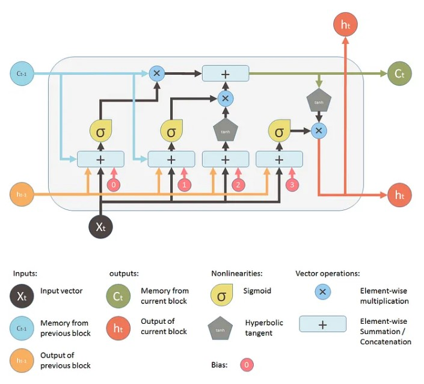
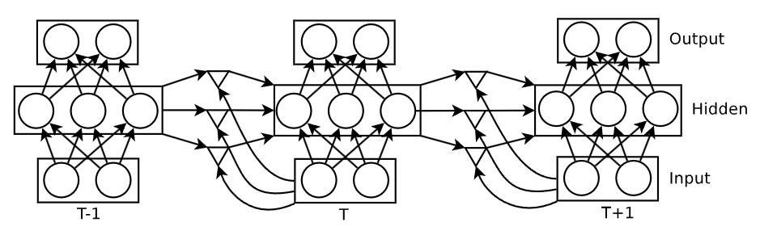

# CPS769 - Introdução à Inteligência Artificial e Aprendizagem Generativa

Este repositório contém as listas de exercícios da disciplina CPS769 - Introdução à Inteligência Artificial e Aprendizagem Generativa, do Programa de Engenharia de Sistemas e Computação (PESC) do Instituto Alberto Luiz Coimbra de Pós-Graduação e Pesquisa de Engenharia (COPPE/UFRJ).

## Questão 1

O objetivo da lista é muito simples: entender um módulo de código e relacionar com os artigos que vimos até o momento.

Na lista 1a, você usou Python e TensorFlow para criar um modelo RNN, sendo que o código foi disponibilizado (já pronto). O programa continha:

```python
# Define the RNN model

model = models.Sequential([

    layers.LSTM(50, activation='relu', input_shape=(num_repeats, 2)),

    layers.Dense(2)

])
```

Descreva e faça um desenho para explicar qual o modelo LSTM usado. Como o modelo trata os dados temporais? Compare com a Figura 3 do artigo _Generating Text with Recurrent Neural Networks_.

**Resposta:**

A LSTM (Long Short-Term Memory) configurada possui 50 unidades em sua camada oculta, o que significa que as duas entradas são processadas e resultam em um vetor de 50 dimensões. Em cada etapa temporal, a LSTM atualiza seu estado interno baseado nas entradas atuais, no estado anterior e nas saídas anteriores, preservando informações importantes ao longo da sequência. Os gates (portas) da LSTM são mecanismos que controlam o fluxo de informações dentro da célula de memória ao longo do tempo. Eles são essenciais para permitir que a LSTM decida o que lembrar e o que esquecer de uma sequência de dados. Existem três principais gates na LSTM:

- **Forget Gate (Porta de Esquecimento):** Esta porta decide quanta da informação antiga deve ser esquecida. Ela recebe a entrada atual e o estado anterior e gera um valor entre 0 e 1 para cada número na célula de memória. Um valor próximo de 0 significa que a informação será esquecida, enquanto um valor próximo de 1 significa que a informação será mantida.
- **Input Gate (Porta de Entrada):** A porta de entrada decide quanta da nova informação que está chegando deve ser armazenada na célula de memória. Assim como a porta de esquecimento, ela gera valores entre 0 e 1 que determinam quanto da nova informação será adicionada ao estado da memória.
- **Output Gate (Porta de Saída):** A porta de saída decide quanta da informação da célula de memória será utilizada para gerar a saída atual da LSTM. Ela controla o que será passado para o próximo estado oculto e para a próxima camada da rede.

Essas portas trabalham juntas para garantir que informações relevantes sejam mantidas ao longo de várias etapas temporais, enquanto dados irrelevantes são descartados.

Sua estrutura pode ser observada no diagrama abaixo, com a diferença de que na figura abaixo a função de ativação é a tangente hiperbólica (tanh), enquanto que no código da lista 1a a função de ativação era a ReLU. Os gates são representados pelos 3 conjuntos de um bloco de soma (+) e um bloco com a função de ativação sigmóide (σ). Da esquerda para a direita, os gates na figura estão posicionados na seguinte ordem: esquecimento, entrada e saída.



_Fonte:_ [Understanding LSTM and its diagrams](https://blog.mlreview.com/understanding-lstm-and-its-diagrams-37e2f46f1714).

Comparando com a Figura 3 do artigo _Generating Text with Recurrent Neural Networks_ (Hinton, 2011), a LSTM usa uma abordagem mais direta, com células que lembram informações importantes por longos períodos. Enquanto a LSTM opera principalmente através de somas ponderadas e funções de ativação simples como ReLU, a MRNN utiliza uma abordagem mais complexa onde os pesos ocultos são ajustados dinamicamente através de operações multiplicativas baseadas nos dados de entrada. Isso torna a MRNN mais flexível e capaz de capturar detalhes mais finos nos dados, especialmente em tarefas de modelagem de texto, mas também a torna mais complexa e exigente em termos de poder computacional.



_Fonte:_ [Hinton, 2011](https://www.researchgate.net/publication/221345823_Generating_Text_with_Recurrent_Neural_Networks).
